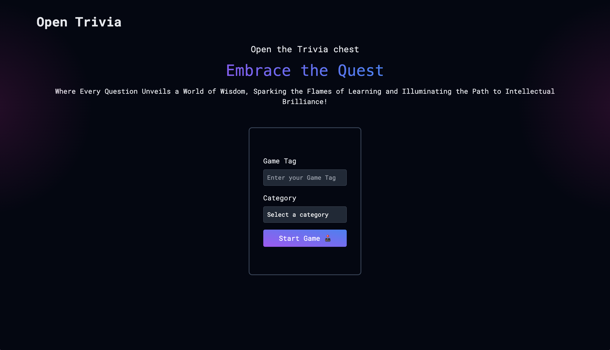
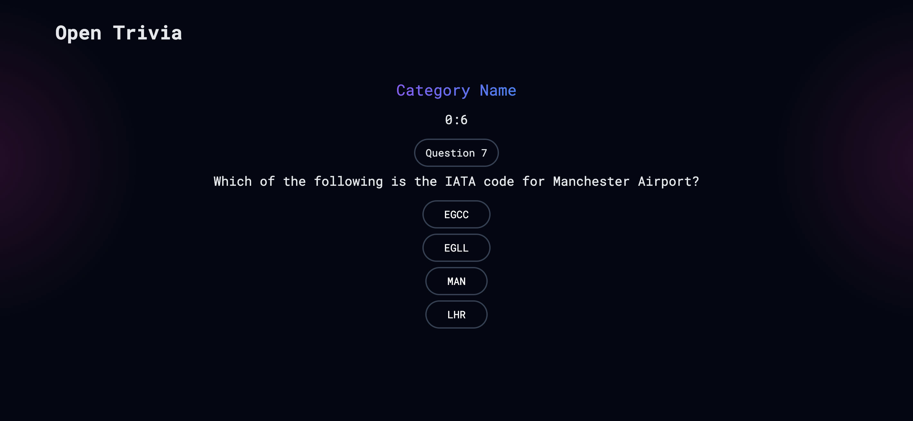
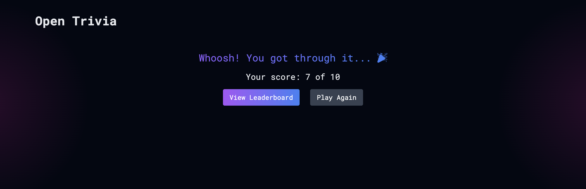
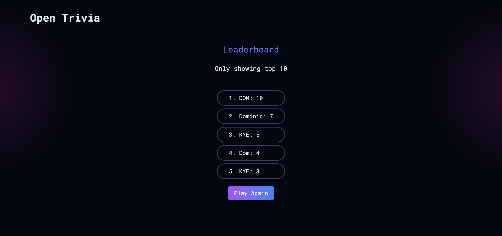

# Open Trivia by Dominic Mulinda

## Project Overview




As a beginner developer, I wanted to build an interactive Trivia Quiz Game web application. This project will not only serve as an engaging and fun experience for users but also as an excellent opportunity for me to apply and expand my web development skills.

You can view the design prototype here: [Open Trivia Figma Prototype](https://www.figma.com/proto/TxwvjJV0w1p3MXtCbjamiz/Quiz-Web---Glowing-%26-Gradient-Text-Style-(Community)?page-id=1%3A130&node-id=827-3357&viewport=463%2C257%2C0.07&t=os7S2VayfmmDDodz-1&scaling=scale-down&content-scaling=fixed&starting-point-node-id=827%3A3357)

You can view the project presentation here: [Project Presentation Link](https://www.canva.com/design/DAGMt91i-ao/_Eos52NueXWJ5OJchtXCEg/view?utm_content=DAGMt91i-ao&utm_campaign=designshare&utm_medium=link&utm_source=editor)

## Why a Trivia Game?

Trivia games are inherently fun and educational, offering several benefits:

1. **Engagement**: Users can test their knowledge across various categories, promoting learning and healthy competition.
2. **Replayability**: With a vast question database, each game session offers a unique experience.
3. **Social Aspect**: Leaderboards encourage users to compete with friends and other players.
4. **Accessibility**: A web-based game can be played on various devices without installation.

## Learning Opportunities

This project provides valuable experience in several key areas of web development:

1. **Frontend Development**: Crafting an intuitive and responsive user interface.
2. **API Integration**: Fetching questions from an external API and managing local data.
3. **State Management**: Handling game logic and user progression.
4. **Asynchronous Programming**: Managing API requests.
5. **Data Persistence**: Storing and retrieving high scores.

## Technologies and Tools

The project will utilize modern web technologies and development tools:

### Core Technologies:
- HTML5: For structuring the web application
- CSS3: For styling and responsive design
- Tailwind CSS: For rapid UI development with utility classes
- JavaScript: For interactive elements and game logic
- JSON Server: Mock Backend for the fetch requests and Data Storage

### Development Tools:
- Visual Studio Code: As the primary code editor
- Git & GitHub: For version control and code management
- json-server: To mock a backend API for storing high scores
- Figma: For designing the user interface and game flow

### APIs and Libraries:
- Open Trivia Database (OpenTDB) API: For fetching diverse trivia questions
- Fetch API: For making HTTP requests to the trivia and local APIs

### Project Structure
```
└── 📁open-trivia
    └── 📁.vscode
        └── settings.json
    └── LICENSE
    └── PITCH.md
    └── README.md
    └── 📁assets
        └── LandingOT.png
        └── LboardOT.png
        └── ResultsOT.png
        └── quizPage.png
    └── package-lock.json
    └── package.json
    └── 📁public
        └── db.json
        └── index.html
        └── script.js
        └── style.css
    └── 📁src
        └── input.css
    └── tailwind.config.js
```

## Key Features

1. User registration with initials(Game Tags)
2. Category selection
3. Timed quiz sessions with multiple-choice questions
4. Score tracking and leaderboard functionality
5. Detailed results review after each game
6. Responsive design for mobile and desktop play

## Project Phases

1. **Planning and Design**:
   - Create wireframes and mockups using Figma
   - Plan the component structure and data flow

   Here are some of the project assets:
   
   
   


2. **Development**:
   - Set up the development environment
   - Implement core game functionality
   - Integrate with OpenTDB API
   - Developing the user interface with HTML, CSS, and Tailwind

3. **Testing and Refinement**:
   - Conducting thorough testing across different devices and browsers
   - Gather feedback and make necessary improvements


## Conclusion

The Trivia Quiz Game project offers an excellent opportunity to create an engaging web application while honing essential web development skills. It combines fun, learning, and technical challenge, making it an ideal project for a beginner developer looking to showcase their abilities and create a portfolio piece.

By building this project, I will gain hands-on experience with modern web technologies, API integration, and user interface design, setting a strong foundation for future web development endeavors.